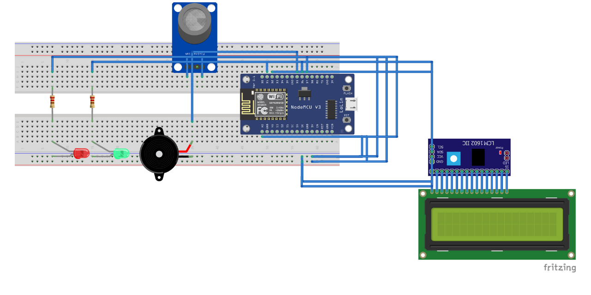

# Gas Leakage Monitoring System (IoT Project)
This is the final project of the Internet of Things course and I worked it on with two of my friends. In this project, we created a Gas Leakage Monitoring System with the help of the NodeMCU board, Blynk App, and the Arduino IDE using C++ programming language. 

This project mainly uses the MQ2 gas sensor and it’s based on IoT technology. That is, we can monitor everything in this security system on the mobile phone using the internet. When power ON this security system, the NodeMCU board connects to the interface created in the Blynk app via the Blynk cloud. Then the system should be activated by the button created in the Blynk app interface. In this case, when a gas leak occurs, it is detected by the MQ2 sensor. Then the buzzer and red LED are activated. At the same time, it notifies our smartphone via a push notification. Also, we can see the gas values on the LCD and Blynk app interface. In the absence of a gas leak, the green LED bulb turns ON and operates normally this security system.

For the detail on how we make it and how it works, you may download and read our report, and also you can watch our project presentation video that I have already attached within this repository.

